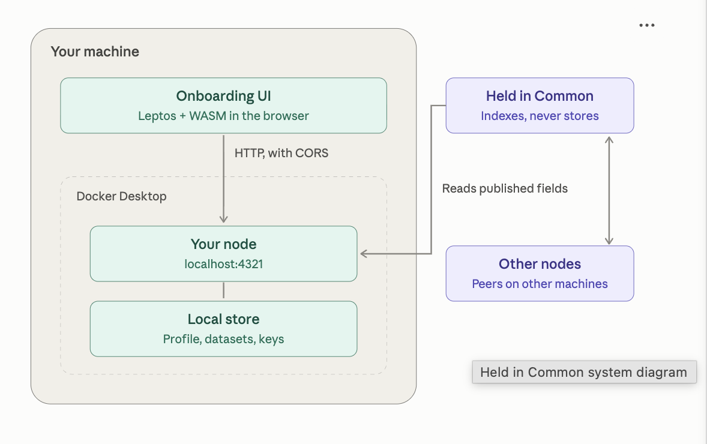

# Held in Common — onboarding (Leptos)

Basic build of a client-side Leptos 0.8 app

## Run

    rustup target add wasm32-unknown-unknown
    cargo install trunk --locked 
    trunk serve --open

## Layout

- `src/check.rs`: the `Check` card and `CheckState` (pending / ok / failed). Presentational only.
- `src/probes.rs`: one async fn per check. `node()` really polls `http://localhost:4321/health`;
  `docker()` and `image()` are stubs because a browser tab can't see Docker.
- `src/onboarding.rs`: wires the three checks, the stepper, and the gated "Set up your profile" button.

## System Diagram 

## Notes

- The node must return CORS headers allowing the page's origin, or the health check will fail.
- Set `SIMULATE_DOCKER_FAILURE = true` in `probes.rs` to preview the failure states.
- Moving to Tauri: keep the UI as is and replace the bodies of `docker()` / `image()` with
  `invoke` calls to Rust commands that shell out to Docker.